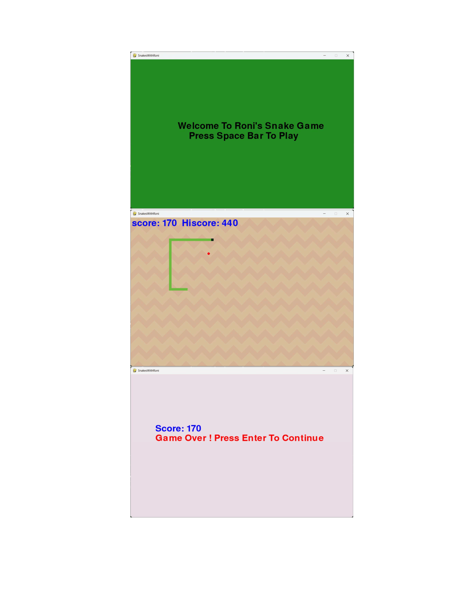

# Snake Game 🐍

A classic Snake Game built with Python and Pygame.

## Features
- Snake grows as it eats food.
- Score and High Score system.
- Background music playlist.
- Game Over sound effects.
- Custom background.
- Switch between songs while playing.

## Controls

| Key | Action |
|------|--------|
| ↑ ↓ ← → | Move Snake |
| N | Next Song |
| B | Previous Song |
| V | Increase Speed |
| A | Decrease Speed |
| M | Increase Snake Size |
| S | Decrease Snake Size |

## Current Music Playlist

The game currently includes:

1. back.mpeg
2. love_your_self.mpeg
3. let_me_love.mpeg
4. star_boy.mpeg
5. PnB_Rock.mp3

More songs will be added in future updates.

## Future Plans

- Add more songs to the playlist.
- Better graphics and animations.
- Pause and resume functionality.
- Multiple difficulty levels.
- New food types and power-ups.
- Improved menu system.
- Mobile version (planned).

## Requirements

```bash
pip install pygame
```

## Run the Game

```bash
python main.py
```
## Game Screenshot



## Author

**Roni Roy**  
GitHub Username: **Roni-Rexor**

## Notes

This project is currently under development. New features, songs, bug fixes, and gameplay improvements will be added in future updates.

⭐ Feel free to star the repository and share feedback!